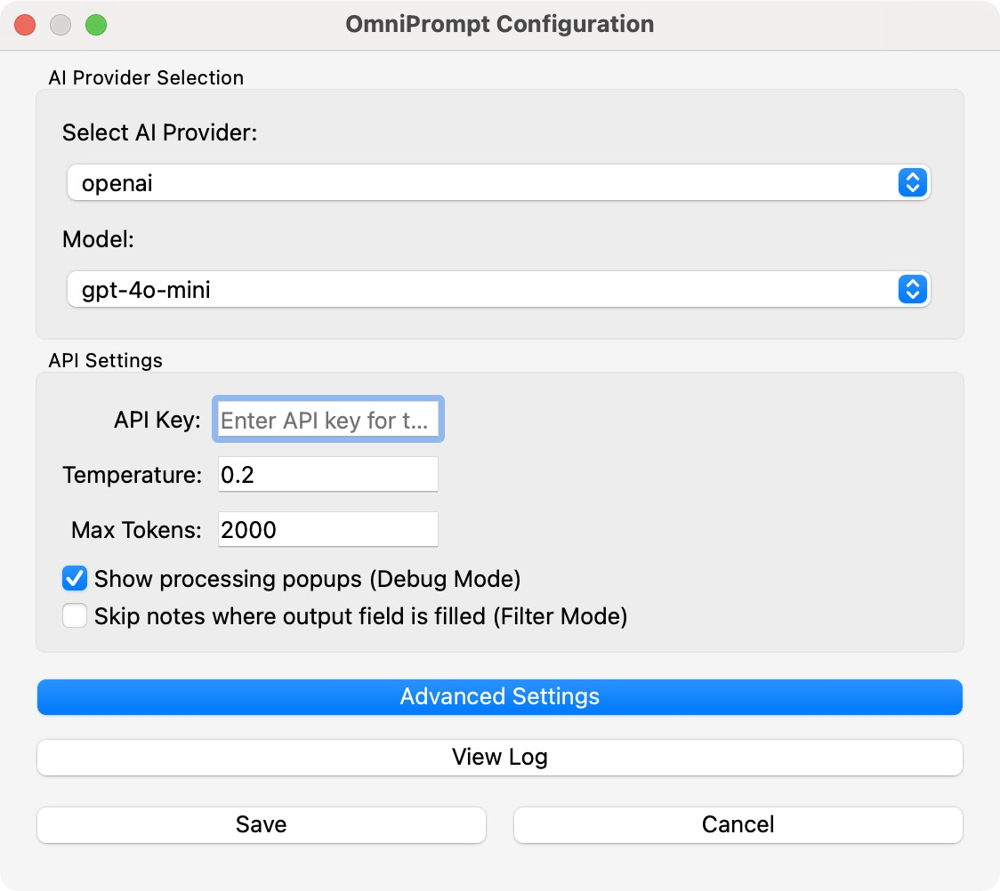
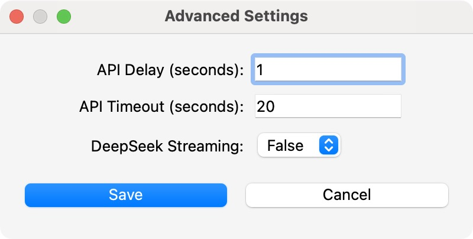
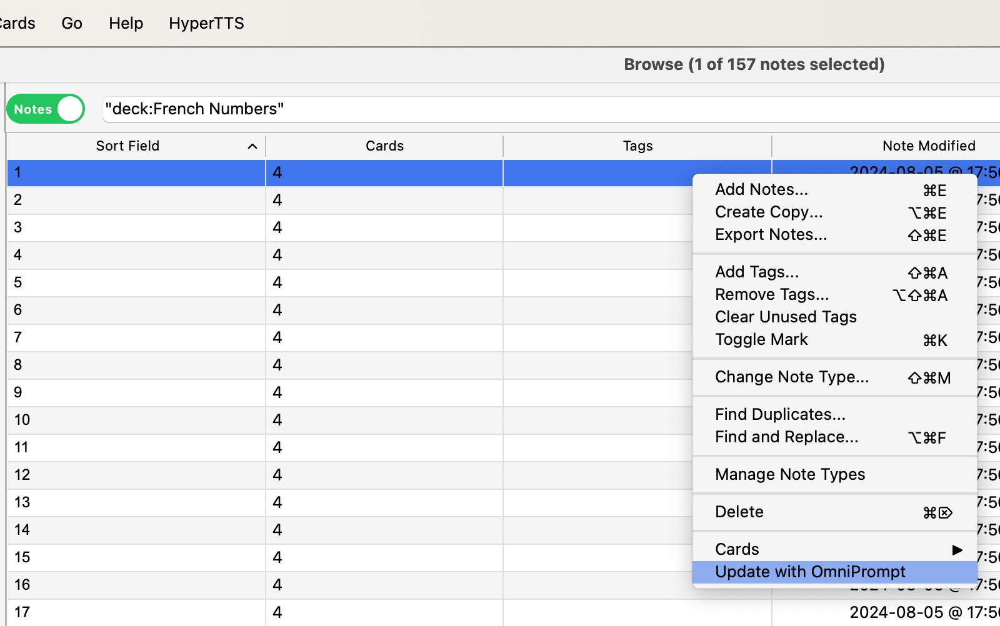
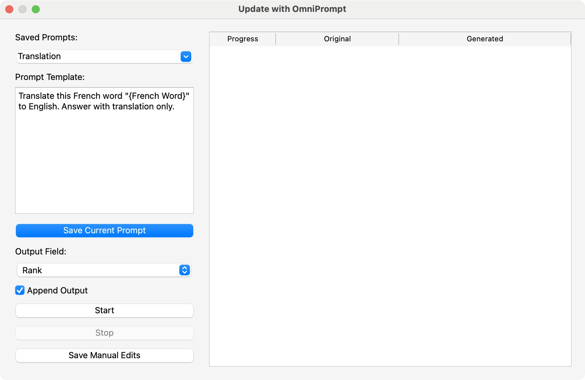

# OmniPrompt Anki 
## v1.1.4
[](https://openai.com)
[](https://deepseek.com)
[](https://gemini.google.com)
[](https://claude.ai/)

**Your AI Anki Assistant!** OmniPrompt Anki is an Anki add-on that enhances your flashcards with AI-powered content generation. It supports multiple AI providers — including OpenAI, Google Gemini, Anthropic (Claude), DeepSeek, and xAI — giving you full control over how your content is created. With features like prompt management, batch processing, filter mode, debug mode, and multi-provider support, OmniPrompt helps you build richer, smarter decks in less time.

## Features
✅ **AI-Powered Content** – Generate definitions, translations, explanations, synonyms, and more.  
✅ **Supports OpenAI, DeepSeek, Anthropic, XAI** – Choose your AI provider. 
✅ **Custom Prompts** – Save and reuse prompt templates with field placeholders.  
✅ **Batch Processing** – Process multiple notes simultaneously.  
✅ **Real-Time Progress Tracking** – Monitor AI generation progress for each note.  
✅ **Flexible Field Selection** – Choose which field to update dynamically.  
✅ **Auto-Save** – Generated content is automatically saved to the selected field.  
✅ **Formatting Cleanup** – Use AI to clean or modify existing text formatting.  
✅ **Advanced Settings** – Fine-tune timeout, delay, and API options.  
✅ **Keyboard Shortcuts** – Quickly process notes with hotkeys.  

---

## User Interface

| Feature | Description | Screenshot |
|---------|------------|------------|
| **Find Add-on Settings** | Open Anki and go to Tools → OmniPrompt-Anki → Settings |  |
| **Settings Menu** |  Configure API Provider (OpenAI, Gemini, etc.), API Key, Model, Temperature, Max Tokens, and toggles like Debug Mode and Filter Mode. |  |
| **Advenced Settings** | Click **Advanced Settings** in the configuration window to modify API Delay, Timeout, and DeepSeek streaming behavior. |  |
| **Manage Saved Prompts**    | View, edit, or delete saved prompt presets in a dedicated UI panel. |  |
| **Update with OmniPrompt** | Right-click in the Anki Browser to update notes using AI. |  |
| **Batch Processing Window** | Track generation progress and view original content alongside AI output during bulk updates. |  |

---

## Installation

### **From AnkiWeb**
1. Open Anki and go to **Tools → Add-ons → Get Add-ons**.
2. Enter the add-on code:
   ```
   1383162606
   ```
3. Restart Anki to complete the installation.

### **From Codeberg or GitHub**
#### **1️⃣ Clone the Repository**
```sh
# Codeberg
git clone https://codeberg.org/stanamosov/omniprompt-anki.git

# GitHub
git clone https://github.com/stanamosov/omniprompt-anki.git
```
#### **2️⃣ Install the Add-on**
1. Navigate to your Anki add-ons directory:
   - **macOS/Linux**: `~/.local/share/Anki2/addons21/`
   - **Windows**: `%APPDATA%\Anki2\addons21\`
2. Copy the `omniprompt-anki` folder into the add-ons directory.
3. Restart Anki.

---

## Setup
1. Open Anki and go to **Tools → OmniPrompt-Anki → Settings**.
2. Select your AI provider **(OpenAI or DeepSeek)** and enter your **API key**.
3. Choose the **AI model** (`gpt-4o`, `gpt-3.5-turbo`, `deepseek-chat`, etc.).
4. Click **Save** and start using the add-on!

---

## How It Works
1. **Select notes in the Anki Browser**.
2. **Right-click → Update with OmniPrompt**.
3. **Pick the output field where AI-generated responses will be stored.**
4. **Choose a prompt out of templates and customize it using placeholders from note fields.**
5. **Clisck Start, AI generates and saves content into the selected notes.**
6. **Edit manually if needed before finalizing, click Save Manual Edits to save your edits.**
7. **Enjoy enhanced flashcards!**

---

## Examples of Use

With OmniPrompt-Anki, you can generate AI-powered content for various learning needs. Customize your prompt to match your study goals. Here are a few practical examples:  

### **Language Translation**  
**Prompt:**  
```plaintext
Translate this French word "{French Word}" to English. Answer with translation only.
```  

### **Word Definitions**  
**Prompt:**  
```plaintext
Explain this Polish word "{Polish Word}". Answer with definition only, do not add any other comments.
```  

### **Synonyms & Vocabulary Expansion**  
**Prompt:**  
```plaintext
What are synonyms for this French word "{French Word}". Answer with a list of synonyms only.
```

### **Text Formatting & Cleanup**  
**Prompt:**  
```plaintext
Format this text "{Explanation}" in markdown. Answer with formatted text only, do not add any comments.
```  

### **Example Sentence Generation**  
**Prompt:**  
```plaintext
Generate two example sentences for language learners at the B1-B2 level using the word "{Word}".
```  
### **Grammar & Verb Conjugation**  
**Prompt:**  
```plaintext
What is the correct form of the French verb "{Verb}" in {Tense} for {Person}? Explain the conjugation rule.
```  

### **Medical Term Explanation**  
**Prompt:**  
```plaintext
Explain the medical term "{Term}" in simple language. Include its symptoms, causes, and treatments.
```  
---

## Customizing Prompts with Note Fields
Use **any field** from your note type in prompts. Field names are **case-sensitive**. You can use **multiple fields** in your prompt and even use your **Output field** for input - it makes possible change formatting of existing fields!

### **Example Using Multiple Fields**
  **PROMPT**:  
  ```
  Generate a detailed explanation for "{Japanese Word}". Include this example: "{Sentence}".
  ```
---

## Advanced Settings
To access these settings, go to **Tools > OmniPrompt > Settings**, then select **Advanced Settings**.

**API Delay** - Adds a short pause between consecutive requests to avoid rate limits.
**Timeout** - Adjusts how long the add-on waits for each API request to finish.
**Streaming** (for DeepSeek) - Enables partial message updates in real time.

---

## Keyboard Shortcuts

**Ctrl+Shift+O (Windows/Linux) / Ctrl+Shift+O (macOS)** - Open the **Update with OmniPrompt** dialog in the browser.  
**Ctrl+Return** - Immediately start processing selected notes.

---

## Logging & Debugging

OmniPrompt-Anki maintains a log file (**omnPrompt-anki.log**) inside the add-ons folder to track API requests, responses, and potential errors. This helps with troubleshooting issues like API connection failures, timeouts, or unexpected responses. The log file is capped at **5MB**, with up to **two backups** to prevent excessive disk usage.  

To make debugging easier, the add-on includes a **View Log** button in the **Settings** menu. Simply open **Tools → OmniPrompt → Settings** and click **View Log** to inspect recent activity and diagnose issues quickly.

---

## 🤝 Contributing

### **How to Contribute**
1. **Fork the repository** on [Codeberg](https://codeberg.org/stanamosov/omniprompt-anki) or [GitHub](https://github.com/stanamosov/omniprompt-anki).
2. **Create a new branch** (`feature-new-functionality`).
3. **Make your changes** and **test in Anki**.
4. **Submit a pull request** with a clear description.

### **Ways to Help**
- **Bug reports & feature requests**: Open an issue on [Codeberg](https://codeberg.org/stanamosov/omniprompt-anki) or [GitHub](https://github.com/stanamosov/omniprompt-anki).
- **Improve documentation**.
- **Optimize code & performance**.

---

## 🛠️ Roadmap
### **✅ Completed**
* [x] Custom prompt creation with field selection support
* [x] Added OpenAI and DeepSeek model integration
* [x] Improved UI with auto-save functionality
* [x] Enhanced multi-note processing interface
* [x] Implemented keyboard shortcuts
* [x] Added advanced settings panel
* [x] Made Browse window remain accessible during OmniPrompt use
* [x] Stored API keys separately for each provider
* [x] Saved output field selection with each prompt template
* [x] Improved prompt search and multi-select in Saved Prompts panel
* [x] Added “Append” mode for output field (non-destructive updates)
* [x] Added Google Gemini API support
* [x] Added Debug Mode toggle to suppress popups for single note use
* [x] Added Filter Mode to skip notes with pre-filled output fields
* [x] Introduced Prompt Cleanup Tool (UI-based management of saved prompts)
* [x] Added support for Anthropic (Claude)
* [x] Added support for xAI models

### **🚀 Planned**
- [ ] Support for more AI models.

---

## 📜 License
This project is licensed under the [**MIT License**](docs/LICENSE). Feel free to use, modify, and distribute it with attribution.

---

## ❤️ Support & Feedback
- Found a bug? Open an **issue** on [Codeberg](https://codeberg.org/stanamosov/omniprompt-anki) or [GitHub](https://github.com/stanamosov/omniprompt-anki).
- Have suggestions? **We’d love to hear your feedback!**
- Want to contribute? See the **Contributing** section.

OmniPrompt-Anki is **completely free** and open-source, created to help learners enhance their flashcards with AI-powered content. If you find this add-on useful, you can support its development by **leaving a positive review on AnkiWeb**. Your feedback helps more users discover the add-on and encourages further improvements.  

## 🙏 Special Thanks

Huge thanks to [u/Smooth-Put5476](https://www.reddit.com/user/Smooth-Put5476/) for their thoughtful suggestions and feedback on the [OmniPrompt-Anki Reddit thread](https://www.reddit.com/r/Anki/comments/1idzmzg/omniprompt_anki_aipowered_addon_for_anki/).  
Many of the improvements in recent versions would not have been possible without their input!

Your support and ideas make this project better for everyone. ❤️

---

👉 [**Rate add-on on AnkiWeb**](https://ankiweb.net/shared/review/1383162606)  

Thank you for your support!
